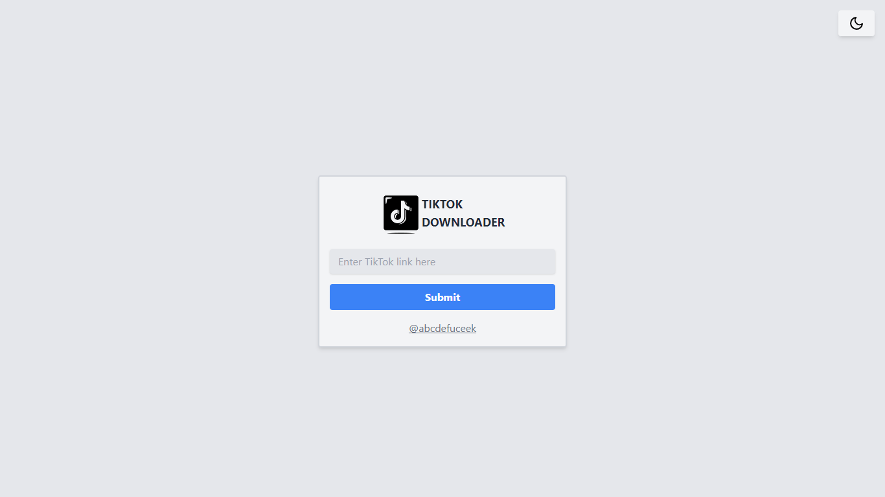

<p align="center">

<h1 align="center">TIKTOK DOWNLOADER</h1>
</p>

# Tiktok Downloader
TikTok Downloader is a simple repo for downloading videos from TikTok. With this it allows you to download TikTok videos easily using the video URL.

## Features

- Download TikTok videos using a URL.
- Save videos in MP4 format.
- User-friendly and easy to use.

## Installation

1. Clone this repository:

    ```bash
    git clone https://github.com/irwanx/tiktok-downloader.git
    cd tiktok-downloader
    ```

2. Install dependencies:

    ```bash
    npm install
    ```

## Usage

1. Run the application:

    ```bash
    npm start
    ```

2. Open [http://localhost:3000](http://localhost:3000) in your browser to view the application.

## Installation on Vercel

You can deploy this TikTok Downloader directly to Vercel without using the CLI by following these steps:

1. Fork this repository to your GitHub account.
2. Sign in to Vercel using your GitHub account at [vercel.com](https://vercel.com/signup).
3. Click on the "Import Project" button.
4. Choose the repository you forked in step 1.
5. Configure the settings as per your requirements.
6. Click "Deploy" to deploy your TikTok Downloader app to Vercel.

## Usage

Once deployed, you can access the TikTok Downloader by navigating to the URL provided by Vercel for your deployed project.

## Preview



## License

This project is licensed under the [MIT](LICENSE) license.

## Contributions
Contributions are very welcome! Please fork this repository and create a pull request with the proposed changes.

## Contact

If you have any questions or concerns, please open an issue or contact me at instagram [@abcdefuceek](https://instagram.com/abcdefuceek).